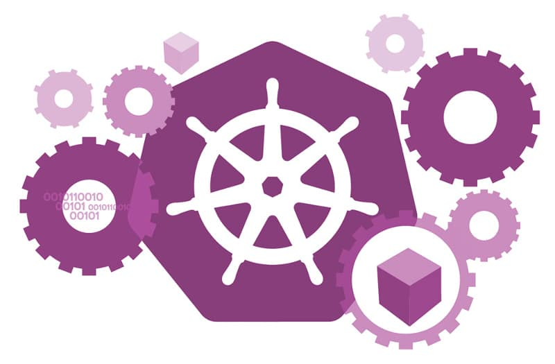

<div align="center">
  
  <h1>do4-k8s</h1>
</div>

This repository aims to have a web app and a microservices that communicates with a microservices. 
It save information in a Postgres and cache them in a Redis.
It is used to demonstrates Kubernetes RBAC and networks probes.

## Installation steps:

Launch the Web Application

```bash
# Go in the web_application folder 
cd web_app
# Installl dependencies
npm install
# Launch the Web application
npm run 
```

Launch the fist microservices

```bash
cd ms
npm install
npm run
```

## Author

This repo was written by [@GridexX](https://github.com/GridexX) in June 🌻
